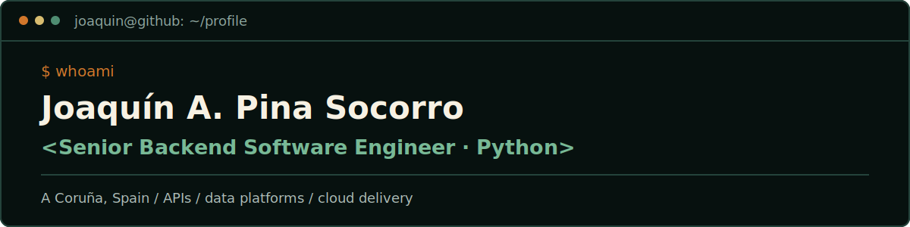

  

  Backend Software Engineer building reliable APIs, data-driven platforms, and cloud systems with Python and Django.

  
  
  

A Coruña, Spain · Spanish (native) · English (B2)

## About

I am a backend engineer with 5+ years of experience building and modernizing web products and data-driven platforms. I specialize in Python, Django REST Framework, REST APIs, microservices, PostgreSQL, ClickHouse, and production delivery on AWS.

I currently lead a small development team, define architecture and technical standards, and take products from requirements to production. Most of my production work lives in private client repositories; my [interactive portfolio](https://portfolio-jpinas.vercel.app/) presents the systems, decisions, and outcomes behind that work.

## What I work on

- **Backend and API architecture** — REST APIs, microservices, role-based access control, and third-party system integrations.
- **Data and ML systems** — PostgreSQL, ClickHouse, ETL workflows, analytics, and Amazon SageMaker integrations.
- **Cloud delivery and leadership** — AWS, Docker, Nginx, GitHub Actions, CI/CD, technical standards, and team delivery.

## Selected impact

- Built a cost-estimation ML model with Amazon SageMaker that reached **92% accuracy**.
- Improved data-loading performance by **73%** and reduced page load time by **20%**.
- Led the migration of a monolithic application toward microservices.
- Designed RBAC and real-time integrations for an operational solar-energy platform.
- Delivered **10+ features** for carbon-emissions tracking and reporting.

## Core stack

| Area | Technologies |
| --- | --- |
| Backend | Python, Django, Django REST Framework, Flask, REST APIs, microservices |
| Data | PostgreSQL, ClickHouse, MySQL, MongoDB, ETL |
| Cloud | AWS Lambda, EC2, S3, SQS, SageMaker, Fargate, API Gateway, CloudWatch |
| Delivery | Docker, Docker Compose, Nginx, GitHub Actions, CI/CD |
| Frontend integration | Vue.js, React, JavaScript, HTML, CSS |

## Beyond engineering

Outside engineering, CrossFit is part of my routine. That is why my [interactive portfolio](https://portfolio-jpinas.vercel.app/) turns my professional journey into a pixel-art game set inside a CrossFit box.

## Contact

For professional conversations, reach me through [LinkedIn](https://www.linkedin.com/in/jpinas1998/), explore the [interactive portfolio](https://portfolio-jpinas.vercel.app/), or email [jpinas1998@gmail.com](mailto:jpinas1998@gmail.com).
